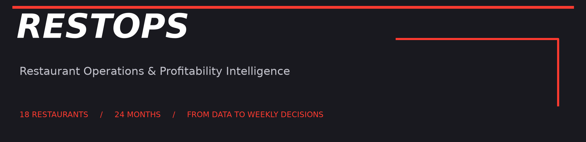
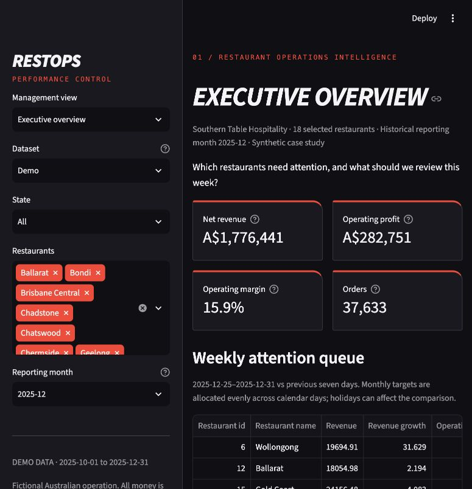
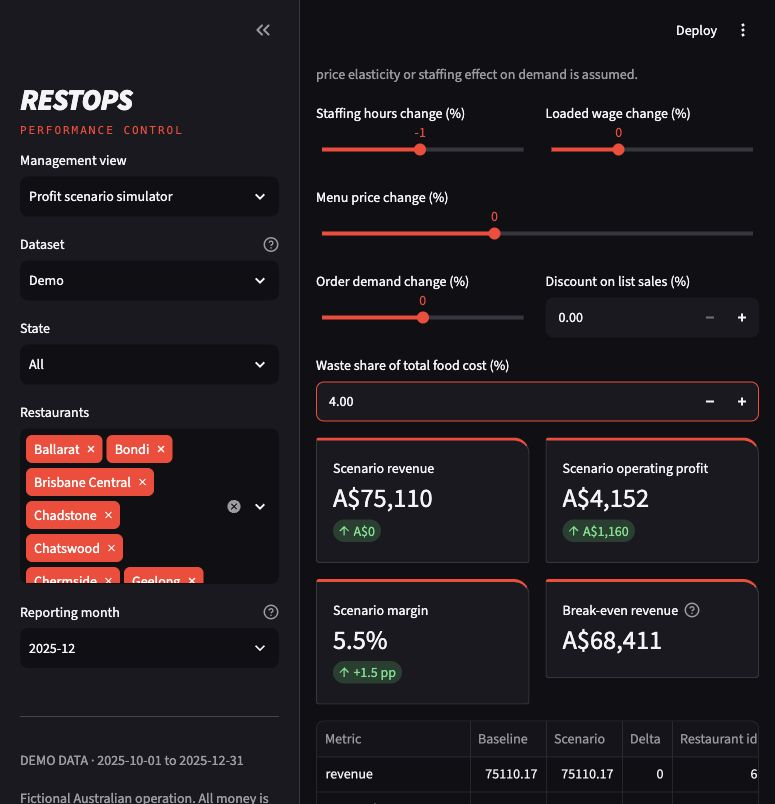
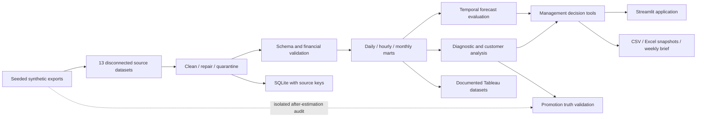

# RESTOPS · Restaurant Operations & Profitability Intelligence

**Restaurant experience translated into commercial decisions, trustworthy analytics and a complete Business Analyst delivery pack.**

**Portfolio project by [Yash Hurdale](https://github.com/yashayyy27)** · Master of Business Analytics · Bachelor of Data Science · Assistant Restaurant Manager experience

18 Australian restaurants · 24 months · **794,925 validated orders** · 2,105,626 product lines

Southern Table Hospitality and every restaurant, employee and customer in this case study are fictional. All results are synthetic. The charcoal/red presentation draws on motorsport performance analysis; it uses no employer or Formula 1 branding.

[Five-minute demo](docs/demo_script.md) · [BA delivery pack](docs/ba_delivery_pack.md) · [Executive summary](reports/executive_summary.md) · [Action plan](reports/business_recommendations.md) · [Weekly brief](reports/weekly_management_brief.md) · [Validation evidence](docs/validation_results.md)

## The management problem

An Area Manager can see that sales changed but cannot easily explain why. POS, rosters, costs, surveys, loyalty and promotions sit in separate systems. Higher sales can coexist with weaker contribution, excessive waste or poor meal-peak coverage.

RESTOPS connects five questions: **Which restaurant needs attention? What moved? What action is plausible? What financial impact could it have? How would we measure whether it worked?** The result is a working local management application, supported by reconciled analysis and a proposed pilot process.

## Try the application

Use Python 3.12. From this repository:

```bash
python3.12 -m venv .venv
source .venv/bin/activate
python -m pip install -r requirements-lock.txt
python -m streamlit run streamlit_app.py
```

Open **http://127.0.0.1:8501**. On Windows activate with `.venv\Scripts\activate`.

A compressed demo of about 716 KB is committed. No raw-data generation, database service, cloud account or API key is needed. Choose **Dataset → Demo**, **December 2025**, and **Wollongong** for the interview case. Auto uses full local marts when present and otherwise falls back to Demo. Demo has exact October–December daily/hourly aggregates; customer, campaign and model evaluation snapshots retain their labelled original scope. Forecasts continue the fictional history into January 2026, not the current calendar date.

## Eight working management views

| View | Decision supported | Working output |
|---|---|---|
| Executive overview | Which stores should I review first? | Weekly attention queue, prorated target, trend, monthly Performance Index, calculated action brief |
| Restaurant investigation | What explains the profit movement? | Exact month-to-month volume/basket and six-cost bridge; product mix, discounts and waste reasons |
| Labour & demand planning | How should coverage change with expected orders? | 28-day hourly demand, suggested service/support hours, template comparison and budget trade-offs |
| Customer & loyalty | Which behaviours warrant a retention experiment? | Fixed-snapshot segments, eligible 90-day cohorts and early-activity comparisons |
| Promotion evaluation | Did an offer plausibly improve contribution? | Eligible location controls, incremental net sales/costs, ROI, exploratory uncertainty and separate truth audit |
| Forecasting | What revenue should I plan for, and how uncertain is it? | Three models, rolling validation, untouched holdout, store-level MAE/RMSE/WAPE and empirical bands |
| Profit scenario simulator | What if staffing, wages, prices, demand, discounts or waste change? | Baseline/scenario ledger, contribution, profit, margin, break-even, demand sensitivity, assumption export |
| Data quality | Can I trust the numbers and trace them? | Schema/keys/relationships, missing values, cleaning audit, quarantine preview and reconciliation checks |

All views contain computed outputs. State, restaurant and month filters have clear scope; campaigns and fixed customer snapshots state where monthly filters do not apply. Metrics have definitions, and tables download as Excel-compatible CSV. The scenario also exports JSON assumptions. The prepared XLSX pack is explicitly a snapshot rather than a live copy of current sliders.

## Actual application screenshots

Captured from the local working Streamlit application; these are not design mockups or Tableau screenshots.





[Restaurant investigation](docs/screenshots/restaurant_investigation.jpg) · [Scenario simulator](docs/screenshots/scenario_simulator.jpg) · [Forecasting](docs/screenshots/forecasting.jpg) · [Labour planning](docs/screenshots/labour_planning.jpg)

## Architecture and data model



POS exports are **product-line grain**, while transactions/average basket KPIs use **complete order grain**. Store/date facts combine independently aggregated orders, shifts, waste, feedback, commission and overhead allocations. Product, campaign and customer facts keep separate grains to avoid inflated totals. IDs and raw/processed SHA256 manifests support traceability.

Read the [architecture and relationships](docs/architecture.md), [source dictionary](docs/data_dictionary.md), [management KPI dictionary](docs/management_kpi_dictionary.md), and [Tableau grain/key catalog](docs/tableau_data_guide.md).

## Synthetic dataset

The generator creates 24 menu products and 13 source exports: restaurants, product-line POS transactions, products, labour, feedback, loyalty, promotions, waste, monthly targets, operating costs, delivery, state calendars and manager assignments. Orders have multiple product lines; the clean order count is therefore distinct from POS row count.

NSW, VIC and QLD stores have different locations, meal peaks, weekday/weekend patterns, annual demand, public holidays, prices/margins, loaded labour costs and simulated manager/service variation. Missing answers and anonymous customer IDs coexist with deliberately injected duplicates, inconsistent names/categories, impossible dates, invalid references, quantities and financial values. Cleaning uses declared rules and business references, never hidden generator truth.

## Analysis that can be defended

- **Financial identity first.** Net revenue already includes discounts. Sold ingredients and waste are counted once; labour, commissions, campaign costs and allocated overheads reconcile to operating profit. The investigation bridge allocates volume/basket interaction explicitly and fails if its residual exceeds one cent.
- **Decision support with assumptions.** Staffing needs derive from prior-only hourly mix and basket values, configurable service productivity/utilisation, integer coverage and retained support hours. The comparator is a repeated historical schedule template, not an uploaded future roster. Suggestions are not a legally compliant roster.
- **Scenarios are separate from forecasts.** Six explicit inputs change a closed cost ledger. Staffing changes do not silently create demand or service improvements. Break-even holds staffing/overheads/campaign spend fixed. Sensitivity ranges are assumptions rather than probabilities. Changing the baseline restaurant/month resets scenario assumptions.
- **Model complexity earns its place.** Weekly seasonal naive, calendar Ridge and gradient boosting answer a four-week labour/stock planning question. Three chronological 28-day validation folds select the model; a final untouched 28-day holdout reports performance. Recursive prediction prevents future actuals entering lag features. Approximate bands use 84 pre-holdout errors per store, with observed holdout coverage reported.
- **Promotion estimates remain observational.** Prior same-weekday sales are adjusted by contemporaneous unpromoted location peers. Discount is already in net revenue; incremental variable and labour costs and campaign spend are reconciled. Overlapping campaigns are excluded using campaign dates. Estimates are unavailable without controls. Generator expectations are stored separately and accessed only after estimation; they describe expected order uplift, not realised counterfactual profit.
- **Relationships prompt experiments.** Store/customer segmentation and controlled satisfaction associations support prioritisation. They do not prove that staffing, redemption or cluster membership causes profit or retention. Recommendations specify proposed owners and service/contribution guardrails.

## Verified findings from the synthetic operation

| Evidence | Commercial interpretation / next action |
|---|---|
| Two-year revenue **A$36.44m**, operating profit **A$4.39m**, margin **12.0%** | Use a consistent cost ledger before comparing stores |
| Wollongong Q4 margin **1.8%**, versus **11.1%** for location peers; labour **46.2%** of sales | Investigate meal-peak coverage and waste; evaluate a controlled roster pilot |
| Gold Coast Q4 waste **7.8%**, peer median **4.3%** | Same-cost-base peer scenario indicates **A$3,630/quarter** opportunity; feasibility and stock-outs must be tested |
| Fully observed identified customers: 90-day repeat **56.3%** | Test second-visit outreach with a holdout; anonymous visitors are outside the denominator |
| Selected forecast: holdout MAE **A$452/store-day**, RMSE **A$587**, WAPE **13.95%** | MAE improves **26.1%** over weekly naive on the chain holdout; examine each store before allocating labour |
| Dec 2025 Wollongong revenue **A$75,110**, profit **A$2,992**, margin **4.0%** | Start the live walkthrough here; vary assumptions and explain the financial trade-offs |

These are calculated fictional results, not achieved business savings. [Eight executive findings](reports/executive_summary.md) contain what/why/impact/action; the [weekly management brief](reports/weekly_management_brief.md) retains store/window keys, evidence and conditional impact formulas.

## Business Analyst evidence

| Capability | Portfolio artifact |
|---|---|
| Problem framing, scope, fictional stakeholder needs | [BA delivery pack](docs/ba_delivery_pack.md), [business requirements](docs/business_requirements.md) |
| Current/future operating process | [Process maps](docs/process_maps.md) |
| Prioritisation and testable user stories | [Backlog](docs/backlog.md), [requirements and acceptance criteria](docs/ba_delivery_pack.md) |
| Delivery accountability | [Requirements traceability](docs/requirements_traceability.md), [decision log](docs/decision_log.md) |
| Acceptance planning with honest evidence | [Proposed UAT](docs/uat_scenarios.md), [actual developer validation](docs/validation_results.md) |
| Commercial definitions and constraints | [KPI dictionary](docs/management_kpi_dictionary.md), [decision methodology](docs/decision_support_methodology.md) |
| Executive communication | [Executive summary](reports/executive_summary.md), [action plan](reports/business_recommendations.md), [quality audit](reports/data_quality_report.md) |
| Interview demonstration and design choices | [Five-minute script](docs/demo_script.md) |

The stakeholder map and scenarios are fictional. No interviews, stakeholder approvals, human UAT or real-world pilot outcomes are claimed. The project connects practical restaurant management questions with data science training and BA requirements/acceptance skills.

## Tableau and Excel

The [four-page Tableau specification](dashboards/tableau_dashboard_spec.md) covers Executive Performance, Restaurant Operations, Customer & Loyalty, and Forecasting & Opportunities, including fields, filters, interactions and safe aggregation. The [catalog](docs/tableau_catalog.json) specifies 15 management datasets with keys/grains. Full generation also exports supporting diagnostics and individual-customer snapshots.

**No native Tableau workbook or published dashboard has been created.** Placeholder paths in `dashboards/screenshots/` are for a future verified Tableau build.

[Download the prepared Excel management pack](reports/exports/weekly_management_pack.xlsx): weekly restaurant review, 28-day daily labour plan, scenario comparison and ReadMe provenance. Real numeric/date cells, filters and frozen headers; no live recalculation or hidden assumed savings. Current app selections download as CSV/JSON. `python -m src.excel_inputs` refreshes typed inputs; optional `tools/export_excel.mjs` uses an available `@oai/artifact-tool` runtime to rebuild XLSX. That optional runtime is not needed to run RESTOPS; the standard pipeline always produces CSV outputs.

## Reproduce the full project

```bash
# Default seed 42, 18 stores, 2024-01-01 through 2025-12-31
python -m src.run_pipeline --regenerate

# Faster rebuild without notebook execution (still generates notebook sources)
python -m src.run_pipeline --regenerate --skip-notebooks

# Verify against the generated source ledger
python -m unittest discover -s tests -v
python -m black --check --workers 1 src tests streamlit_app.py
python -m compileall -q src tests streamlit_app.py

# Optional offline executive reports
python -m http.server 8765 --bind 127.0.0.1
# Open http://127.0.0.1:8765/reports/portfolio.html
```

Configuration: [config/project_config.json](config/project_config.json). Exact installed dependency versions: [requirements-lock.txt](requirements-lock.txt). Full generation takes several minutes and writes large local CSV/SQLite files that are ignored by Git. Six notebooks examine source generation, cleaning, exploration, operations, customers and forecasting. Run from the repository root; notebook execution requires a local Jupyter kernel.

Demo-only checks without raw generation:

```bash
python -m unittest discover -s tests -p test_management.py -v
python -m unittest discover -s tests -p test_planning.py -v
python -m unittest discover -s tests -p test_app.py -v
python -m unittest discover -s tests -p test_promotion.py -v
python -m unittest discover -s tests -p test_exports.py -v
```

GitHub Actions runs formatting, compilation, portable-demo workflows, fixed-seed generation and full tests. Local validation is documented separately from GitHub workflow results. See [validation results](docs/validation_results.md) for actual local evidence.

## Repository

```text
opspulse/
├── streamlit_app.py       # Eight-view management application
├── .streamlit/           # Local theme and server configuration
├── .github/workflows/    # Reproduction and validation workflow
├── config/               # Seed / dates / operating assumptions
├── data/{raw,processed,tableau,demo,validation}/
├── notebooks/            # Six executed analysis notebooks
├── src/                  # Generation, cleaning, validation, marts, models,
│                         # financial scenarios, staffing and management briefs
├── sql/                  # Schema / business queries / independent KPIs
├── dashboards/           # Four-page Tableau build specification
├── reports/              # Executive/action/quality briefs, figures, XLSX
├── docs/                 # BA pack, dictionaries, traceability, demo, screenshots
├── tests/                # Ledger, contracts, temporal isolation and app workflows
├── tools/                # Optional native Excel snapshot builder
└── requirements{,-lock}.txt
```

## Limits and next validated steps

Synthetic demand and operational mechanisms shape the results. Two years of history do not establish real-world effectiveness. Promotion controls are imperfect, daily bootstrap intervals ignore serial dependence, customer follow-up is selective, and forecast bands are approximate. Margin excludes tax, financing, depreciation and capital expenditure; loaded wages and simplified holidays/GST are illustrative rather than award/tax advice. Monthly targets are allocated evenly for weekly review; no transaction/mix budget exists to support a causal target-gap decomposition.

Development used AI-assisted coding and documented local validation. Existing commit history is retained; fictional stakeholder needs and proposed experiments are disclosed throughout.

RESTOPS is a local, single-user portfolio application, without authentication, production connectors or deployment. The proposed next steps are manager validation of service assumptions, a measured roster/preparation pilot, a randomised promotion trial and native Tableau authoring. These remain proposals, not completed approvals or business results.
