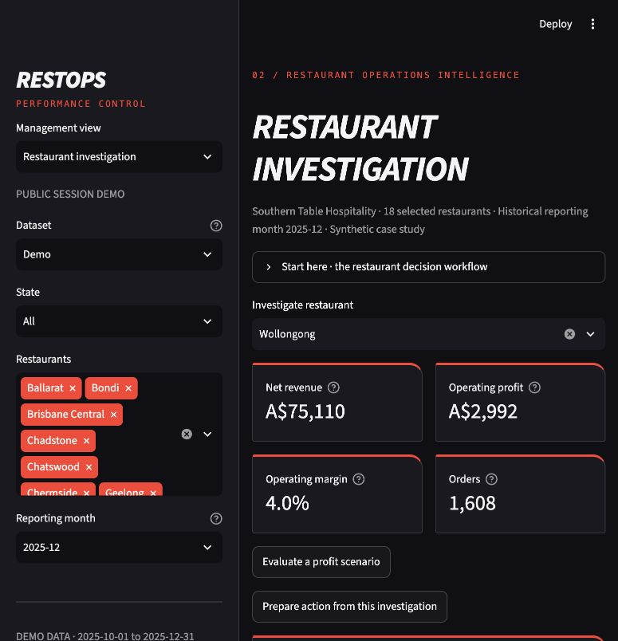

# RESTOPS · Restaurant Operations & Profitability Intelligence

**RESTOPS helps an Area Manager turn a restaurant's missed targets into a reconciled investigation, a costed scenario and a measurable proposed intervention.**

Portfolio by **[Yash Hurdale](https://github.com/yashayyy27)** — Master of Business Analytics, Bachelor of Data Science and Assistant Restaurant Manager experience.

- **Commercial reasoning:** explain profit movement with an exact volume/basket/cost bridge, then test six operating assumptions without double-counting costs.
- **Business Analyst delivery:** connect requirements, acceptance criteria and evidence to an action tracker with frozen baselines, fictional owners, service guardrails and outcome reviews.
- **Trustworthy analytics:** separate data grains, validate against SQL, evaluate forecasts chronologically, and disclose promotion confounding and synthetic-data limitations.



[](https://github.com/yashayyy27/RESTOPS/actions/workflows/ci.yml)

**Entirely synthetic:** 18 fictional Australian restaurants; January 2024–December 2025; 794,925 validated orders. The portable demo contains exact October–December 2025 aggregates and labelled customer/campaign/model snapshots. No employer data, branding, stakeholder interviews, achieved savings or real approvals are claimed.

## Experience it in two minutes

**A hosted app has not been published.** Run the public-session demonstration with Python 3.12:

```bash
git clone https://github.com/yashayyy27/RESTOPS.git
cd RESTOPS
python3.12 -m venv .venv
source .venv/bin/activate
python -m pip install -r requirements-demo.txt
python -m streamlit run deployment/streamlit_app.py
```

Open **http://127.0.0.1:8501**. On Windows use `.venv\Scripts\activate`.
Choose **Start here → Open Wollongong investigation**. Public mode always uses
committed synthetic data; action edits are session-only. For persistent local
SQLite actions, run `RESTOPS_MODE=local python -m streamlit run streamlit_app.py`.
See [setup and full reproduction](docs/setup.md) and [deployment readiness](docs/deployment.md).

## One restaurant decision case

**Identify:** Wollongong's December 2025 synthetic revenue is **A$75,110**,
operating profit **A$2,992** and margin **4.0%**. Investigate its target gap and
November–December bridge before proposing a cause.

**Evaluate:** reduce staffing hours by **1%** and set waste to **4%**, holding
prices and demand unchanged. The same-month scenario estimates profit around
**A$4,152** — approximately **A$1,160** above baseline. This conditional result is
not an achieved benefit or forecast; feasibility and service effects are untested.

**Propose and measure:** save those assumptions to the Action & experiment tracker,
assign a fictional owner, define a labour-share threshold and satisfaction/delivery
guardrails, and specify an observational comparison. The seeded example is a
**proposal with no outcomes or approval**. Later practice outcomes are explicitly
simulated or unverified user-entered observations. Before/after does not prove
causality; overlapping opportunities are never presented as guaranteed savings.

## Evidence and interview material

| What to inspect | Artifact |
|---|---|
| End-to-end decision demonstration | [Two-minute walkthrough and shot list](docs/two_minute_demo.md) · [Five-minute interview script](docs/demo_script.md) |
| My reasoning and contribution | [Design choices and AI-assisted development](docs/design_choices.md) · [Ten interview questions](docs/interview_questions.md) |
| Business Analysis delivery | [BA pack](docs/ba_delivery_pack.md) · [Requirements traceability](docs/requirements_traceability.md) · [Process maps](docs/process_maps.md) · [UAT scenarios](docs/uat_scenarios.md) |
| Calculations, models and data grain | [Technical reference](docs/technical_overview.md) · [KPI dictionary](docs/management_kpi_dictionary.md) · [Action data model](docs/action_tracker.md) |
| Findings and proposed actions | [Executive summary](reports/executive_summary.md) · [Action plan](reports/business_recommendations.md) · [Weekly brief](reports/weekly_management_brief.md) |
| Verification and unresolved findings | [Current upgrade validation](docs/upgrade_validation.md) · [Earlier validation record](docs/validation_results.md) · [Tests](tests/) |
| Tableau handoff | [Verified data build bundle](dashboards/tableau_build/restops_tableau_bundle.zip) · [Exact workbook instructions](dashboards/tableau_build/BUILD.md) · [Four-page specification](dashboards/tableau_dashboard_spec.md) |
| Excel snapshot | [Weekly management pack](reports/exports/weekly_management_pack.xlsx), clearly separate from current app filters |

The app has nine working views: executive, investigation, labour, customers,
promotions, forecasting, scenario, quality and actions. The charcoal/red design
uses motorsport cues without Formula 1 assets. Source code is modular Python;
SQLite, SQL, Pandas, NumPy, Plotly, scikit-learn and executed Jupyter notebooks
support the analysis. Large generated datasets and local action databases stay
outside Git; demo inputs and regeneration commands are provided.

**Remaining boundaries:** no verified native Tableau workbook or published
dashboard; no live POS/payroll integrations or authentication; staffing suggestions
are not legally compliant rosters; forecasts continue fictional history into
January 2026 and bands are approximate. The action tracker records decisions and
reviews but does not run experiments or verify entered outcomes. Development used
AI-assisted coding and documented developer checks, not real-manager UAT.
