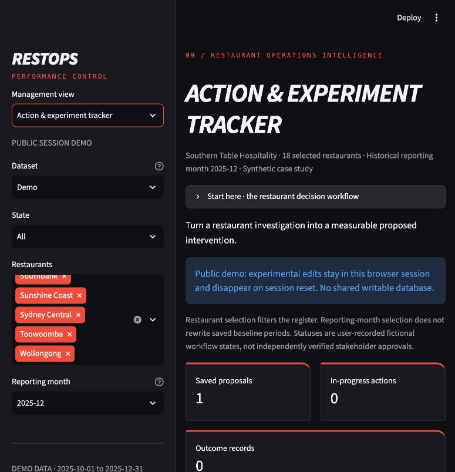
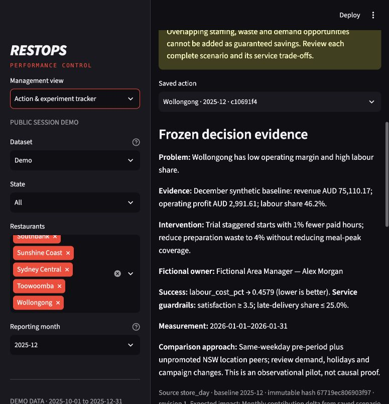

# Action & Experiment Tracker

The tracker closes the fictional decision workflow: identify → investigate →
scenario → proposed intervention → success definition → labelled outcome review.
It does not run experiments, verify external observations or confer stakeholder
approval. Before/after comparisons are descriptive and do not establish causality.

## Records and grain

| SQLite table | Key / grain | Immutable evidence |
|---|---|---|
| actions | action_id UUID; one restaurant/baseline month | restaurant, calendar month, baseline ledger and ratios, source classification/fingerprint, snapshot hash, creation timestamp |
| revisions | action_id + revision integer | measurement plan, all scenario assumptions, computed scenario ledger, revision reason and UTC timestamp |
| events | action_id + sequence integer | user-recorded status and required explanation; revisions requiring reapproval add a proposed event |
| outcomes | outcome_id UUID; action_id + revision relationship | simulated/user_entered classification, observation dates, primary metric plus two guardrails, provenance notes and review |

Schema version 1 is checked at open. Column layout, immutability triggers,
foreign keys and SQLite integrity are validated. UPDATE and DELETE triggers block
in-place evidence changes. JSON forbids nonfinite values; nonviable break-even
estimates are explicitly null. Snapshot hash detects changed baseline/source
JSON. UTC timestamps describe record creation; business dates remain date-only.
This is append-only application evidence, not cryptographically signed or
administrator-proof storage. The exact schema is implemented in `src/actions.py`.

**Revisions:** the original baseline never changes. Revised assumptions or
measurement plans append a separate revision; prior estimates/reviews remain
visible. An approved or in-progress action returns to proposed on revision, so
an old approval cannot silently apply to new assumptions. Stale revision/status
writes fail. Outcomes always retain the revision against which they were measured.

**Workflow:** proposed → approved → in progress → completed; cancellation is
allowed from each nonterminal state. Completed/cancelled are terminal. Completion
requires a reviewed observation covering the entire latest measurement window.
Partial observations can be recorded but cannot alone complete an action.
Meeting the threshold does not override failed service guardrails. Status records
are fictional user entries, not real approvals independently verified by RESTOPS.

## Creation and validation

Use **Prepare action** in investigation (unchanged assumptions) or simulator
(current six assumptions). Draft snapshots survive filter changes. The register
responds to restaurant selection; the reporting-month filter never changes saved
baselines. Define problem/evidence/intervention, fictional owner, pilot dates,
measurement dates, primary metric and target, satisfaction minimum, maximum late
share, comparison/confounders and expected-impact basis. All are required.

The pilot starts after the baseline month. Measurement must be inside the pilot
window. Rates use fractions, satisfaction 1–5; all numerical inputs are finite.
Success direction is explicit: labour/waste share lower, revenue/profit/margin/
satisfaction higher. Currency success thresholds refer to observation-window
amounts; different duration baseline totals require normalisation before any
before/after comparison. No automatic savings aggregation or causal estimator
is built into the tracker.

## Three different kinds of evidence

1. **Scenario estimate:** calculated from frozen historical synthetic baseline
   and explicit assumptions. No outcomes are created when saving it.
2. **Simulated outcome:** a user explicitly enters hypothetical values for a
   practice review. The application does not manufacture these values.
3. **User-entered observed outcome:** recorded input with provenance/review notes,
   marked unverified. In this synthetic portfolio it does not become evidence of
   real employer results. The tool does not validate origin, randomisation or controls.

Service review uses primary threshold, satisfaction floor and late-delivery cap;
stock-outs are discussed in review notes rather than an automated data field.
Choose a credible comparison and inspect demand, seasonality, holidays, promotions
and other operational changes. A before/after improvement can be confounded.
Do not add staffing, waste and demand opportunities as guaranteed savings.

## Seeded Wollongong proposal

Stable ID `c10691f4-018d-5a91-8c76-27d6f21265d2`; December 2025 baseline;
−1% paid hours and 4% food-waste share; unchanged wages, prices, discounts and
demand. Proposed January 2026 pilot; labour-share threshold; satisfaction ≥3.5
and late deliveries ≤25%. These illustrative guardrails require manager review.
The saved comparison proposes weekday-aligned pre-period plus eligible NSW peers.
It has **one proposed event, no approval and no outcome records**. The scenario
profit change is conditional and refers to December's duration; it is not a
January forecast or achieved result. Seeding is idempotent.

## Persistence and export

Local: ignored `outputs/actions.sqlite`, optional RESTOPS_ACTION_DB; reopen retains
UUIDs and evidence. Public: one SQLite memory database per Streamlit session,
never st.cache_resource/global state; no filesystem database is opened. Public
entry point forces mode and committed data. Markdown summaries and complete JSON
exports include snapshot/source hashes, revisions, status notes, observations,
review classifications and limitations. Exports are snapshots, not live links.

## Actual application views

These captures show the current public-session build and the seeded fictional proposal.

