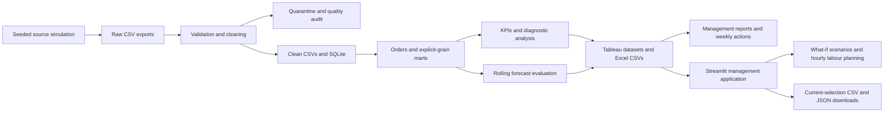
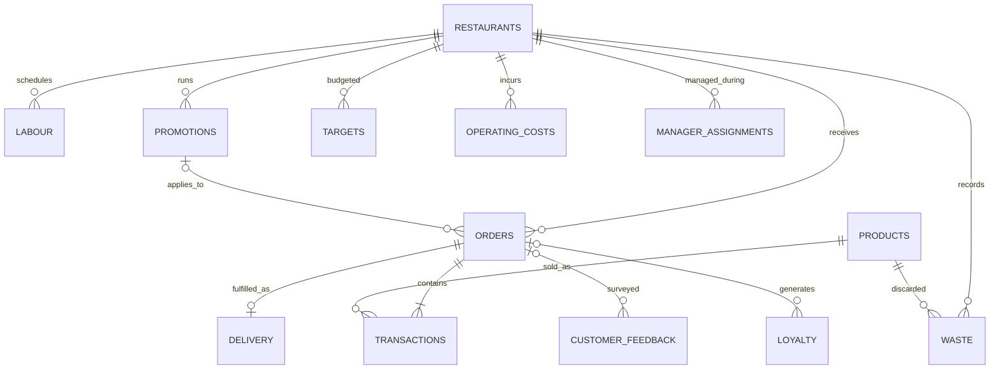

# Architecture and relationships

## Layers

| Layer | Responsibility | Main entry point |
|---|---|---|
| Source simulation | Operational mechanisms and deliberate export defects | `src/generate_data.py` |
| Cleaning | Keys, taxonomy, valid quantities, complete orders, audited repairs | `src/clean_data.py` |
| Features | Orders, product-month, store-day and hourly capacity | `src/feature_engineering.py` |
| Metrics | Rates from aggregate inputs, targets, performance index | `src/kpi_engine.py` |
| Diagnostics | Customers, stores, promotions, associations, anomalies | `src/analysis.py` |
| Forecasting | Time-based model comparison, holdout and future forecasts | `src/forecasting.py` |
| Database | Explicit schema, indexed facts, integrity checks | `src/database.py` |
| Presentation | Charts, executive findings, offline visual overview | `src/reporting.py` |
| Decision support | Weekly queue, exact bridges, scenarios and hourly plans | `src/management.py`, `src/scenarios.py`, `src/planning.py` |
| Application | Scoped eight-workflow local UI; full marts or committed demo | `streamlit_app.py`, `src/app_views.py`, `src/app_data.py` |
| Source validation | Post-clean contracts, SQL reconciliation and source hashes | `src/validation.py` |
| Management exports | Weekly brief, new marts, compressed demo and typed Excel inputs | `src/build_management.py`, `src/excel_inputs.py` |
| Orchestration | One command, run metadata and notebook generation | `src/run_pipeline.py` |

## Logical relationships

Calendar joins use `(business_date, state)`. Identified customers are represented
by anonymous IDs in orders and loyalty; no real personal information is stored.
Generator-only expected promotion treatment values live under `data/validation/`
and are excluded from source/model inputs. `build_management` compares estimates
with this isolated truth only after diagnostic estimation has completed.
Promotions have one campaign/store record with `eligible_category = All`. This
keeps campaign costs unique; a later category-specific offer could use a separate
eligibility bridge without repeating campaign spend.

## Preventing duplicated metrics

Orders are built from complete sales baskets. Labour, waste, feedback, delivery,
overheads and campaign costs are independently aggregated to store/day before
joining. Monthly financials sum these additive values and recalculate rates.
Raw facts must never be directly joined to each other using only restaurant/date.

Store-day overheads allocate monthly amounts evenly across calendar days, and
campaign costs evenly across active dates. These are analytical allocations;
monthly totals preserve the source cost ledger.

## Reproduction and storage

CSV is the portable exchange format. SQLite is the local query engine. Generated
large files are excluded from Git; a seed, configuration, package lock and sample
tables support reproduction. Notebooks run against already-built marts by
default so opening a notebook does not regenerate millions of rows.

The app reads analytical marts rather than millions of product lines. It caches
the bundle using the manifest timestamp and never trains models during a slider
change. Critical financial/planning functions are pure and independently tested.
The 92-day demo is exact compressed aggregates with separately labelled full-
snapshot customer, campaign and forecast evaluation evidence.
