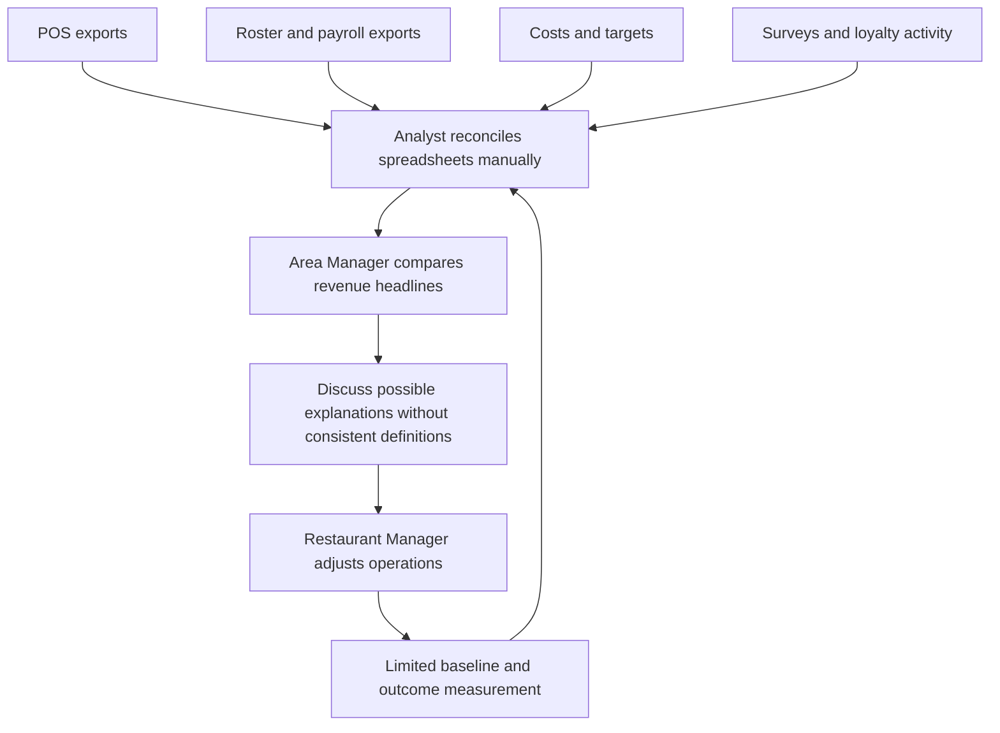
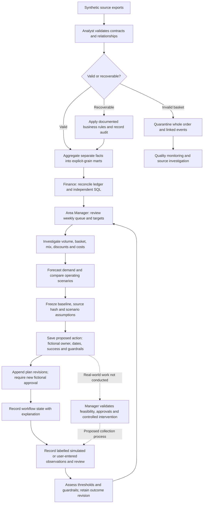

# Current-state and future-state processes

These processes and roles are fictional design assumptions. They do not describe
observed employer processes or validated stakeholder interviews.

## Current state

Problems: mismatched grains, repeated costs, missing records, unclear definitions,
unmeasured actions and a focus on revenue rather than contribution.

## Future state implemented for analysis

The solid path is implemented analysis and evidence recording. Dashed steps are proposed real-world operational work;
the repository does not invent approvals, executed interventions or benefits.
